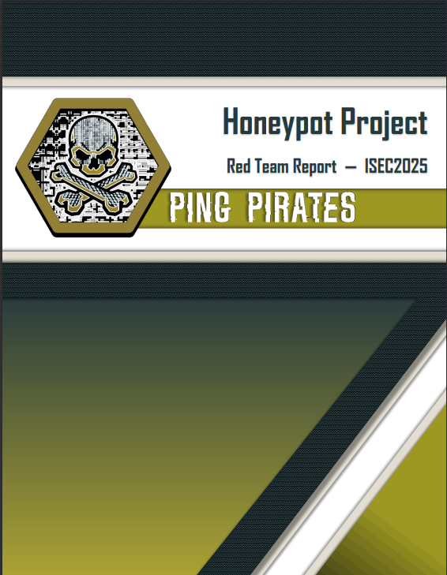
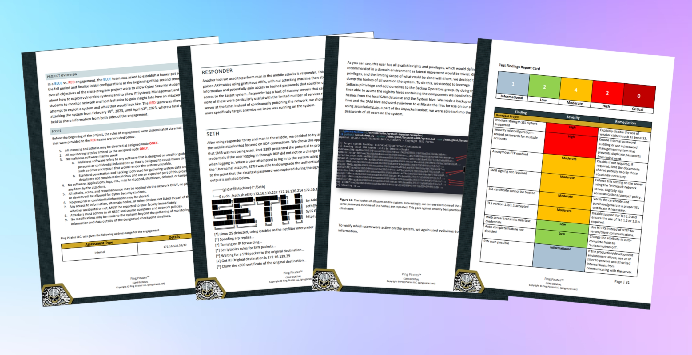

+++
title = 'Red vs. Blue'
date = 2023-12-09T19:05:03-04:00
draft = false
+++

## Systems vs. Security

During a cross-program project between systems administration and cyber security students, the cyber security students were tasked with breaking into a stand-alone server administered by the systems students. We broke off into teams and were given the IP address of our target server.

Our team chose the name 'Ping Pirates' and began enumerating the target machine. Using common tools such as nmap to find out which ports were open and what services were running, we discovered a limited range of ports and a dashboard running on a random ephemeral port. 

Among the open ports was port 21, potentially offering ftp access. We enumerated this port more closely and found that it offered anonymous login, allowing us to access a staff list which could then be used to generate a list of usernames. Once we generated a list of potential usernames following common patterns (first.last, last.first, firstinitial.last, etc.), we did some quick brute force attacks to see if there were any accounts with weak passwords. After running these brute attacks with larger wordlists, it became apparent that this would not be a viable means of gaining initial access; this was made painfully obvious when we later discovered that all passwords were above 14 characters in length, with the most privileged passwords randomly generated and up to 20 characters.

We then changed focus and tried to assess how the systems students would be using the machine and looked into intercepting traffic to gain more intel. We knew they had the standard RDP port open and that they had a dashboard for a monitoring platform. We decided the best thing to do would be to try and relay traffic to either (a) intercept a login to their monitoring platform, as it did not use https, or (b) use a tool like Responder to relay traffic and potentially gain hashes.

This eventually yielded some identifiable IP addresses (thanks to ettercap), which we then honed in on to try and put ourselves in the middle of communications between the users logging in to the target server. Despite running Responder with various options to try and intercept useful hashes, nothing in scope was captured that would grant us further access to the target. This led us to look into possible RDP man-in-the-middle tools that would provide us with at least a low-level user account, ultimately leading to a tool called SETH (link seth here).

After trying unsuccessfully to intercept an RDP session, a team member who was feeling particularly optimistic nudged us into trying again. For whatever reason, the gods blessed us that morning, and within minutes SETH had captured a set of credentials with RDP access to the target server. At first, we were not entirely sure what level of privilege this user had, as the name for the user was quite generic and did not imply that they had any special privileges. However, upon using these captured credentials (which were acquired in clear text as the user had ignored the certificate warning entirely), we enumerated the user's privileges and discovered that this was the 'admin' user for the server. After a little more exploration of the configuration of the server, we found out that the system administrators had switched the name of the default Guest and Administrator accounts so that anyone thinking they admin rights would be sorely disappointed. Fortunately, the credentials we obtained were for a new user that was set up to perform highly privileged actions on the server. 

Due to the scope of the exercise, we were discouraged from establishing interesting forms of persistence and potentially destructive forms of execution. As a result, we decided instead to learn some more about the forms of monitoring that they had established to try and catch anyone accessing the server maliciously. We discovered some firewall rules that had been set up, as well as some PowerShell scripts that described how often event logs were analyzed for specific event IDs (service creation, user creation, etc.). This would have been a perfect blueprint for an attacker as they could easily identify the types of actions that would lead to detection.

Once the activity was over, we wrote up a detailed report summarizing all of our findings in the form of a penetration test summary, including the severity of findings and suggested remediations. This was followed by a debrief with the students who were responsible for monitoring the target server. Interestingly, they suspected someone had gained access to the server but had no clue as to how they had acquired credentials. The opportunity to talk with the other team was valuable and allowed us to share the different approaches we took to defending and attacking. Overall, this was a valuable experience that could be further improved with some changes to the scope of the activity, especially post-compromise objectives. 

