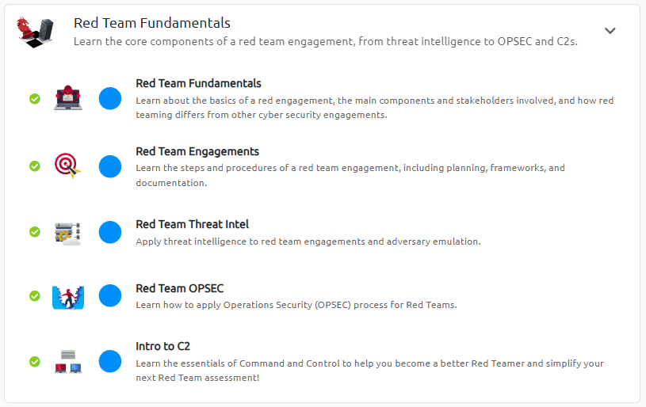
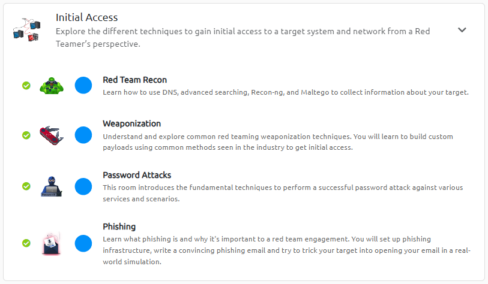
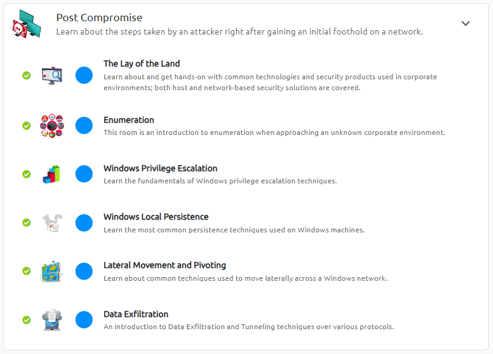
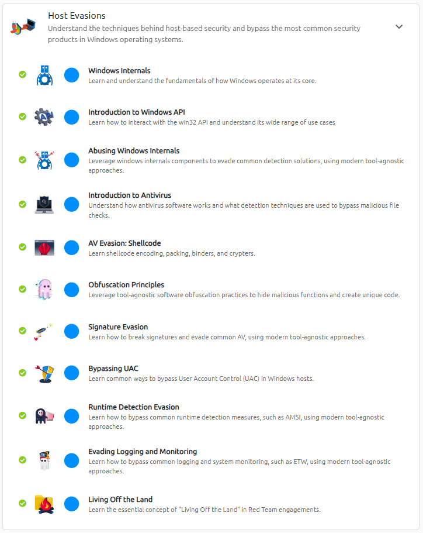
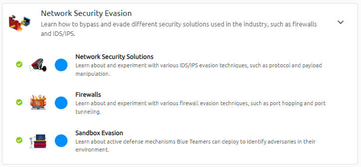
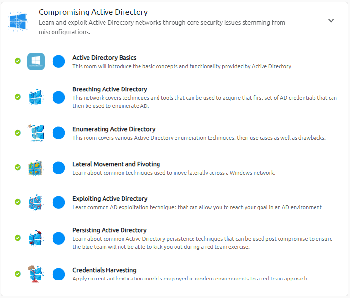

+++
title = 'THM Red Team Pathway'
date = 2023-12-09T19:07:47-04:00
draft = false
+++

The Red Team Pathway on TryHackMe is a detailed and thorough exploration of a multitude of concepts required for red teaming. The pathway involves a wide range of rooms that offer excellent descriptions of reconnaissance, initial access techniques, post compromise escalation and pivoting, host evasion, network security evasion, and Active Directory compromise. The breadth of detail in these rooms is fantastic for those looking to take a closer look at red teaming concepts. Additionally, there are lots of practical examples and exercises in each room, culminating in Part 6 of the pathway, a very enjoyable collection of miniature network environments demonstrating how to breach, enumerate, pivot, exploit, and establish persistence when targeting Active Directory infrastructure.

To provide a full walkthrough of the experience of completing these challenge rooms could fill volumes, so below are summaries of the rooms that either most appealed to me or those that stood out in terms of the learning experience provided.

### Part 1 - Red Team Fundamentals

In this initial section, many of the concepts will be familiar to those studying information security, though the emphasis on operational security does well to set up the scope for all of the rooms that follow, making it easy to understand why certain more stealthy methods of attack are especially useful when performing a red team exercise. The most interesting room for me in this part of the pathway was the 'Intro to C2' room. This room describes the use of multihandlers and port forwarding to manage traffic between the C2 server/listener and the target machine, and the 'Common C2 Frameworks' subsection provides a good overview of options. Among the frameworks described, Sliver stood out as one of the tools worth investing further time in. In fact, this is a tool that I would later include in a malware development project as the C2 backbone.

### Part 2 - Initial Access

This section of the pathway provides some great practical examples of payload development and delivery techniques, including some exploration of the use of PowerShell (though this really just scratches the surface). Beyond this, the 'Phishing' room leverages GoPhish to provide a great practical example of generating a phishing campaign for a red team engagement. Similar to the content related to PowerShell, this still mostly functions as an introduction to the process of generating a believable campaign, but the practical element definitely adds to the learning experience (a common plus throughout the pathway).

### Part 3 - Post Compromise

This part of the pathway was perhaps one of the most valuable areas to explore and rounded out prior knowledge I had in relation to working your way up through a machine. I especially enjoyed the escalation and persistence subsections, each of which detailed some common quick wins and some of the most common misconfigurations that lead to escalation and persistence opportunities. The techniques explore well-know paths that can help round out your toolbox, including backdooring the logon screen and taking advantage of MSSQL servers to set up. These sections exemplify the strengths of this pathway, as the exposure to a broad range of applicable techniques and the opportunity to employ them helps develop a sense of confidence picking up new exploits and then figuring out how to use them. I feel like I definitely became more adept at identifying the different weaknesses of certain systems and then linking that to how I would attempt to either escalate privileges or set up a form of persistence. 

This section also includes the first self-contained network environment to attack. The 'Lateral Movement and Pivoting' room containing this network also includes a more detailed look at tunneling and port forwarding. Completing this network helped solidify my understanding of proxying and forwarding commands from an attack box to machines that weren't immediately available. Also, exposure to a range of tools in this area provides options when trying to pivot between different devices. The best tool covered in this area is probably proxychains, which is incredibly useful when the tools you want to run can't be found on the machine you are attacking.

One last area from this subsection that was of particular interest was data exfiltration, a regular bugbear of many an enterprise. Among the more common methods, such as TCP sockets and SSH, the inclusion of ICMP and DNS is a nice thought-provoking addition that results in you questioning whether any protocol could eventually be used to stealthily and patiently move data out of a network.

### Part 4 - Host Evasions

Part 4 is probably the section that will take the longest to complete, though the time investment pays off in terms of how much it offers. This section doesn't just go over simple obfuscation but also goes into a good level of detail about how to code specific elements of an exploit so that various forms of detection are rendered useless. Of all the sections within the pathway, this one challenged me the most in terms of being able to find solutions to the more open challenges included. I plan to revisit this section in the future to not just hopefully recognize how far I have come, but also to find further novel ways of approaching the problems.

In addition to coding examples for payload development, this section also includes descriptions of common LOLBINs that are used to perform malicious actions in ways that are more difficult to detect. Using a built-in tool to decode your payload feels very rewarding when you can successfully chain together techniques and rely on the utilities already on the target machine.

If I had to recommend rooms from this section, I would probably recommend the 'Runtime Detection Evasion' and 'Obfuscation Principles' rooms. These challenge rooms provide lots of practical experience in modifying your code to bypass specific forms of detection. They also represent a significant jump in difficulty level which is especially rewarding to overcome, helping you feel ready for the network rooms in the final part of the pathway.

### Part 5 - Network Security Evasion

This is the shortest section of the pathway but still provides a useful look into evading sandbox environments, something especially important once you have invested significant time into a payload and don't want it triggering until it can actually affect the target. The 'Sandbox Evasion' room also ties in well with the foundations developed in the 'Obfuscation Principles' room. This occurs often throughout the pathway, with one section introducing a concept, another applying it in practice, and another building on it in combination with some of the other concepts learned.

### Part 6 - Compromising Active Directory

This section presents the best opportunity to put all of the different elements together. The rooms model a full kill chain, moving from enumeration and initial access to lateral movement and persistence. This is a great opportunity to explore the concept of continually establishing various forms of persistence and then using the foothold to gain the next step toward the final objective. This collection of rooms also functions as a great chance to determine whether or not there are specific areas that require more focus. 

Looking back at the pathway as a whole, this is a fitting end in that it places all of the different concepts covered into the main type of environment that will be attacked in red team engagements. This section also builds on those concepts and introduces further techniques that apply specifically to Active Directory. These networks are contained enough that you always know what the current and final goal are, allowing you to connect some ideas that may not have seemed as related beforehand.

In terms of takeaways, this pathway was fantastic as a learning tool to become more confident in the methodology that would be required to perform a red team engagement. I was impressed by the breadth of content offered and the areas included. This comprehensive coverage and the detailed nature of the explanations allows you to apply the new techniques quickly in a realistic setting and determine where those kinds of techniques could be used in future engagements. The wide range of tools mentioned was also a major benefit, helping round out areas where previously I would not have been aware of suitable programs or utilities. Overall, the pathway was superb and is an experience I would wholeheartedly recommend to others looking to expand their skills and knowledge in the area of red teaming.